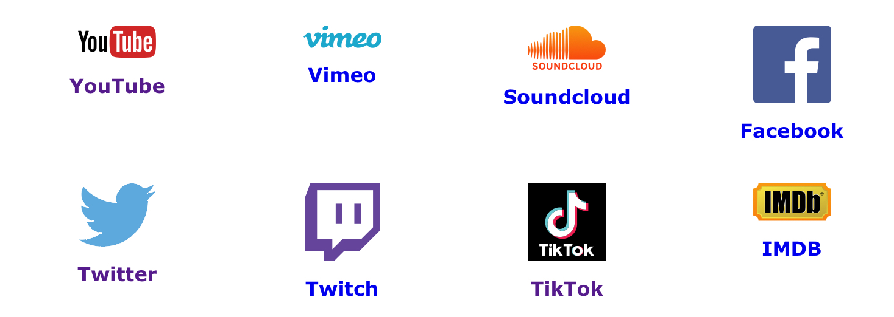

# YTD YouTube Downloader
It downloads videos. It's in the title.

## Supported Sites


## Installation
This is for Windows, just google how to do it on your system.
### Step 1
Install python, if you haven't already.
``` https://www.python.org/downloads/ ```
### Step 2
Install pip if you don't have it. (Check with 'py -m pip -- version'.)
```https://bootstrap.pypa.io/get-pip.py```
### Step 3
Do a quick pip of 'urllib3'.
### Step 4
Install ABP.
Chrome/Edge: https://chrome.google.com/webstore/detail/adblock-plus-free-ad-bloc/cfhdojbkjhnklbpkdaibdccddilifddb
Firefox: https://addons.mozilla.org/en-GB/firefox/addon/adblock-plus/
Safari: https://apps.apple.com/gb/app/adblock-plus-for-safari-abp/id1432731683?mt=12
Opera: https://addons.opera.com/en-gb/extensions/details/opera-adblock/
### Step 5
Download 'ytd.py' from the releases tab.
